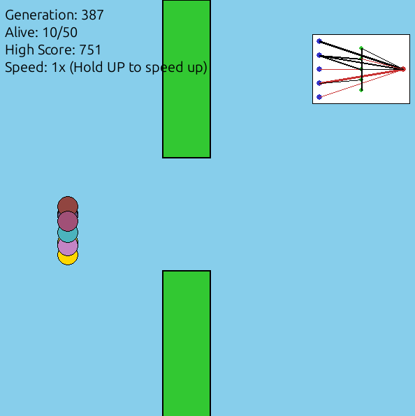

Neuro-Evo-Flappy: AI Learns to Flap
===================================

**Neuro-Evo-Flappy** is a self-contained machine learning project that demonstrates **NeuroEvolution of Augmenting Topologies (NEAT)** built from scratch.

Instead of using a pre-made library like `neat-python`, this project implements a custom genetic algorithm to evolve a population of neural networks. Watch as generations of AI birds learn to navigate pipes, evolving their own neural topologies (adding neurons and connections) in real-time.

🧠 Features
-----------

-   **Custom Genetic Algorithm:** Implements core evolutionary concepts including mutation (weights, new nodes, new connections), crossover, and elitism without external ML libraries.

-   **Dynamic Topology:** The neural networks don't just learn weights; they evolve their structure. You can watch them grow from simple direct connections to complex networks with hidden nodes.

-   **Real-Time Visualization:** A live view of the best performing bird's neural network is displayed in the corner of the screen, showing active firing paths.

-   **Procedural Graphics:** No external image assets are required. The entire game engine and visuals are drawn procedurally using Pygame.

-   **Speed Control:** Train faster by fast-forwarding the simulation.

🛠️ Requirements
----------------

-   Python 3.x

-   `pygame`

-   `numpy`

🚀 Installation & Usage
-----------------------

1.  **Clone the repository:**

    ```
    git clone https://github.com/mohammadd13579/neuro-evo-flappy.git
    cd neuro-evo-flappy
    ```

2.  **Install dependencies:**

    ```
    pip install pygame numpy
    ```

3.  **Run the simulation:**

    ```
    python neuro_evo_flappy.py
    ```

🎮 Controls
-----------

-   **Hold UP Arrow:** Fast-forward training (50x speed).

-   **Hold DOWN Arrow:** Return to normal speed (1x).

-   **Close Window:** Exit the program.

🔬 How It Works
---------------

### The Neural Network

Each bird possesses a unique `Genome` (Neural Network).

-   **Inputs (5):** Bird Y-position, Bird Velocity, Distance to next pipe, Top pipe Y-coordinate, Bottom pipe Y-coordinate.

-   **Output (1):** Probability to Jump (> 0.5 triggers a jump).

-   **Hidden Layers:** Initially 0. The algorithm adds hidden neurons randomly over generations to solve more complex trajectory problems.

### The Evolutionary Cycle

1.  **Generation 1:** 50 birds with random weights and simple connections attempt to fly. Most crash immediately.

2.  **Selection:** Birds that travel the furthest get a higher fitness score.

3.  **Crossover & Mutation:** The best birds breed.

    -   **Weight Mutation:** Existing connections become stronger or weaker.

    -   **Topology Mutation:** Rare chance to add a new connection between unconnected nodes or split a connection to add a **new hidden neuron**.

4.  **Next Gen:** The new population replaces the old, inheriting the best traits.

📷 Preview
----------

